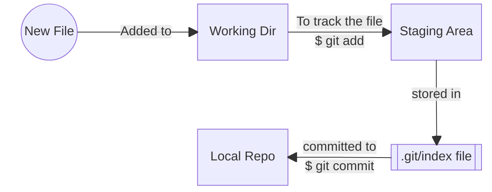
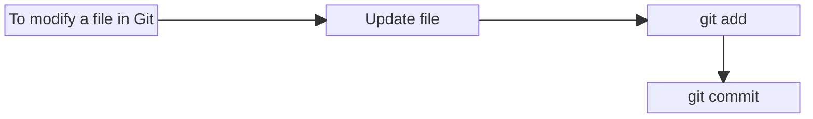
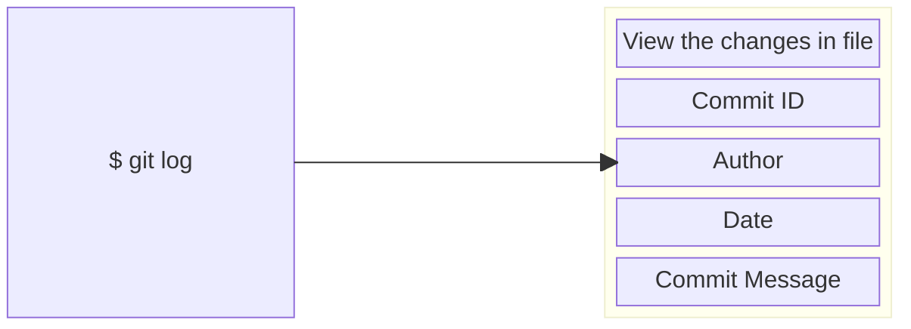

# GIT TRAINING

## LESSON 1 GIT BASICS
### 1.1 Introduction
- [Git basics with examples]()
- [Steps to install git on Mac]()
- [Git configuration levels](#16-git-configuration-levels)
- [Steps to configure Git](#17-demo-configuring-git)
### 1.6 Git Configuration Levels

There are three configuration levels in Git:

```bash
# Local overrides Global and Global overrides System Level.
SYSTEM -> GLOBAL -> LOCAL

git config --system
git config --global
git config --local
```

The following settings needs to be configured for all commits:
```bash
user.name
user.email
```

### 1.7 Demo Configuring Git
There are several configurations that should be made
```bash
git config --global user.name "Your name"
git config --global user.email "youremail@example.com"
git config --global color.ui "auto"
```
For information related to the number of configurations:
```bash
git config --list
git config --system --list
git config --global --list
git config --local --list
```

### 1.8 Key takeaways
- Git is a version control system. It has a distributed architecture.
- It provides a flexible environment to work collaborately and securely.
- You can create and manage remote repositories using Git
- Git facilitates the branching and merging of files within the main repository.
- Git allows every user to have a copy of the project files locally, Thus making the files in the server secure.
- There are three levels of configuration in Git: System Level, Global Level, and Local Level.
- User settings in Git are mainly defined at Global Level because they correspond to user level settings for all repositories.

### 1.9 Knowledge Check
1. What are the characteristics of a version control system?
    - [ ] Recording changes to a file or set of files over time
    - [ ] Identifying who made the changes and when
    - [ ] Comparing and reverting to a previous state.
    - [x] All of the above

2.  Which of the following would be true of how a distributed version control system is used?
    - [ ] Each developer would manually copy their files into a time-stamped directory
    - [ ] Every developer can check out project files from a central server, but would have to refer to the central server for project history details
    - [x] Every developer would have a local copy of the entire repository including files and project history
    - [ ] Every developer would have a local copy of the entire repository including files but excluding project history.

3. What are the three levels of configurations available in Git?
    - [x] System, Global, and Local
    - [ ] System, Global, and User
    - [ ] Global, User, and Repository
    - [ ] User, System, and Global


## LESSON 2 GETTING STARTED WITH GIT

### 2.1 Introduction
- [Creating a Git repository](#22-creating-a-git-repository)
- [Git workflow](#24-git-workflow)
- [Tracking file changes]()
- [Reverting to earlier commits]()
- [Deleting files in Git]()
- [Ignoring files in Git]()
- [Renaming files in Git]()

### 2.2 Creating a Git Repository
Steps to create a Git repository
- Create an empty dir & change the current working dir
    ```bash
    mkdir <dir-name> && cd <dir-name>
    ```
- Convert the directory into repository
    ```bash 
    git init 
    ```
- Run git status
    ```bash
    git status
    ```
####
> :memo: **Note:** <ins>**Git init** command creates a hidden directory that stores all the metadata required for it to function.</ins>

### 2.4 Git Workflow

**Git's three stage workflow**<br>



> :memo: **Note:** While committing, it is important to add a message string using **-m flag**. If missed, a default editor opens asking for comments.

**Managing and Viewing Changes**





> :memo: **Note:** To restrict the output one-line, execute **$ git log --oneliner**, this will display the information in a single line.